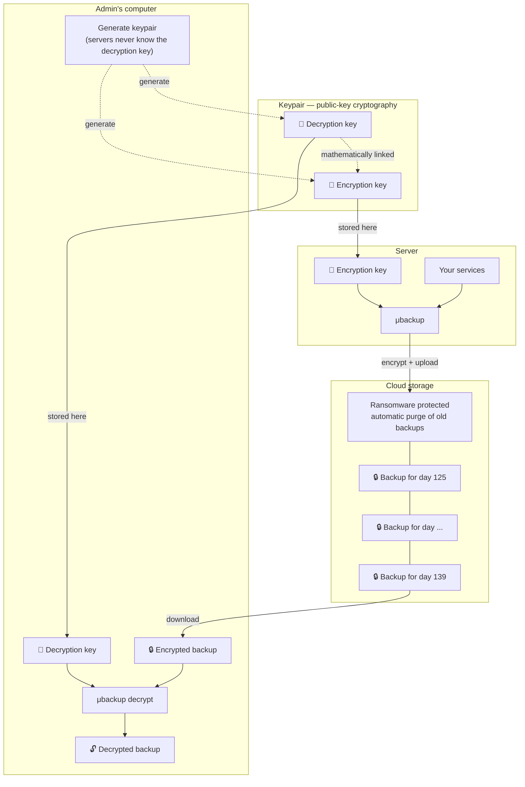
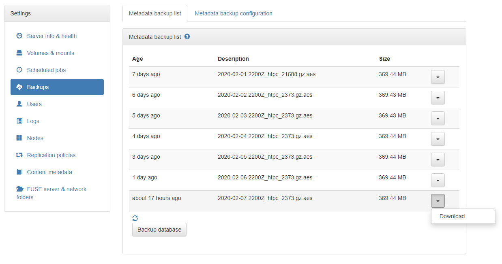
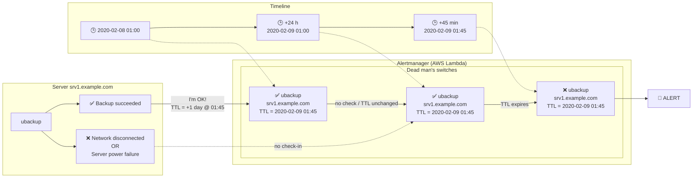

[](https://github.com/function61/ubackup/releases)
[](https://hub.docker.com/r/fn61/ubackup/)


µbackup is a program/library/Docker image for taking backups of your Docker containers (or
traditional applications) 100 % automatically, properly encrypting and uploading them to S3.



Contents:

- [Backing up: Docker containers](#backing-up-docker-containers)
- [Backing up: traditional applications](#backing-up-traditional-applications)
- [Security & encryption](#security--encryption)
- How to use:
  * [As Docker service](#how-to-use-as-docker-service)
  * [Binary installation](#how-to-use-binary-installation)
  * [Part of a script](#how-to-use-part-of-a-script)
  * [As a library](#how-to-use-as-a-library)
- [Restoring from backup](#restoring-from-backup)
- [Example configuration file](#example-configuration-file)
- [S3 bucket IAM policy](#s3-bucket-iam-policy) (security + ransomware protection)
- [Backup retention](#backup-retention)
- [How can I be sure it keeps working?](#how-can-i-be-sure-it-keeps-working)


Backing up: Docker containers
-----------------------------

(You need to run the µbackup Docker service, or if you run it as an application on your
Docker host, configure the Docker integration via µbackup config)

µbackup takes backups from your stateful Docker containers 100 % automatically. Here's how:

```
+------------+     +-----------------------------+      +------------------------------+      +--------------+
|            |     |                             |      |                              |      |              |
| Once a day +-----> For each container:         +------> Compress & encrypt stdout    +------> Upload to S3 |
|            |     | - if backup command defined |      | of backup command            |      |              |
+------------+     |                             |      |                              |      +--------------+
                   +-----------+-----^-----------+      +------------------------------+
                               |     |
                               |     |
                               |     |
                 +-------------v-----+---------------+
                 |                                   |
                 |  Execute backup command inside    |
                 |  the container, taking its stdout |
                 |  as the backup stream             |
                 |                                   |
                 +-----------------------------------+
```

`ubackup.command` is a container's label (specified during
`$ docker run -l "ubackup.command=..."` for example) that contains the command used to take
a backup of the important state inside the container.

For different use cases, for `ubackup.command` specify:

- If you need to backup a single file inside a container
  * Use: `cat /yourfile.db`

- For databases etc. that support atomic dumping, e.g. PostgreSQL
  * Use: `pg_dump -U postgres nameOfYourDatabase`

- For a directory
  * Use: `tar -cC /yourdirectory -f - .`
  * `-` means `$ tar` will write the archive to `stdout`, `.` just means to process all files in the
    selected directory).

- If there's no tooling inside the container (think Dockerfile `FROM scratch`), if you have a Docker
  volume you want to archive in its entirety
  * Use: `dockervolume://` and µbackup will find the volume source data via
    Docker and use `$ tar` (from host-side) to dump the whole directory tree.
  * For this option, if you run µbackup as a container you have to run µbackup with
    `$ docker run -v /var/lib/docker/volumes:/var/lib/docker/volumes`

This simple approach is surprisingly flexible and its streaming approach is more efficient
than having to write temporary files.

You don't have to compress the file inside the container, since that is taken care of for you.


Backing up: traditional applications
------------------------------------

First look at the process for how Docker containers are backed up. Traditional applications
follow the same principle where µbackup just backs up the stdout stream of a command it
executes (just not inside a container this time).

Look for the "static targets" configuration keys in the example configuration file.


Security & encryption
---------------------

The backups are encrypted with per-backup 256-bit AES (in CTR mode with random IV)
key, which itself is asymmetrically encrypted with 4096-bit RSA public key. This means
that immediately after the backup is complete, µbackup forgets/loses access to the actual
encryption key, and only the user holding the private key will be able to decrypt the
backup. This way the servers nor Amazon can ever access your backups (if you store the
private key somewhere else).

If you are serious about security, with this design you could even store the private key
in a [YubiKey](https://www.yubico.com/) (or some other form of HSM).


How to use: as Docker service
-----------------------------

First, do the configuration steps from below section "How to use: binary installation".

You only need to do them to create correct `config.json` file. Now, convert that file for
embedding as ENV variable:

```console
$ cat config.json | base64 -w 0
```

That value will be your `UBACKUP_CONF` ENV var.

Now, just deploy Docker service as global service in the cluster (= runs on every node):

```console
$ docker service create --name ubackup --mode global \
	--mount type=bind,source=/var/run/docker.sock,target=/var/run/docker.sock \
	-e UBACKUP_CONF=... \
	fn61/ubackup:VERSION
```

Note: `VERSION` is the same as you would find for the binary installation.


How to use: binary installation
-------------------------------

Download appropriate release binary for you from the download link.

Create encryption & decryption keys:

```console
$ ./ubackup decryption-key-generate > backups.key
$ ./ubackup decryption-key-to-encryption-key < backups.key > backups.pub
```

(For security you should not actually ever store (or even generate) the decryption key on
the same machine that takes the backups, but this is provided for demonstration purposes.)

Create configuration file stub (and embed encryption key in the config):

```console
$ ./ubackup config example --pubkey-file backups.pub > config.json
```

Edit the configuration further (specify your S3 bucket details)

```console
$ vim config.json
```

Install & start the service:

```console
$ ./ubackup scheduler install-systemd-service-file
Wrote unit file to /etc/systemd/system/ubackup.service
Run to enable on boot & to start now:
    $ systemctl enable ubackup
    $ systemctl start ubackup
    $ systemctl status ubackup
```


How to use: part of a script
----------------------------

In your script, you can call `$ ubackup manual-backup ...`.

Call `manual-backup` with `--help` to get options you need to specify.


How to use: as a library
------------------------

Or: using inside your own application.

See [Varasto](https://github.com/function61/varasto) for an example.

You can pretty much take a data stream from anywhere and give it to µbackup for
compression, encryption and storage. In Varasto we take atomic in-process snapshot of the
database and hand out the snapshot stream to µbackup.

Varasto even has an UI for displaying/downloading the backups - powered by µbackup library APIs:




Restoring from backup
---------------------

Remember to test your backup recovery! Nobody actually wants backups, but everybody wants
a restore. Without disaster recovery drills you don't know if your backups work.

Download the `.gz.aes` backup file from your S3 bucket. You can also do it from µbackup CLI
(just give the service ID the backup was stored under - in this example it's `varasto`):

```console
$ ubackup storage ls varasto
varasto/2019-07-25 0830Z_joonas_10028.gz.aes
varasto/2019-07-26 0825Z_joonas_10028.gz.aes
```

The lines output are "backup ID"s, which is enough info to download the backup:

```console
$ ubackup storage get 'varasto/2019-07-26 0825Z_joonas_10028.gz.aes' > '2019-07-26 0825Z_joonas_10028.gz.aes'
```

Now you have the encrypted and compressed file - you still have to decrypt it.

The `decrypt-and-decompress` verb of µbackup requires path to your decryption key, reads
the encrypted backup file from stdin and outputs the decrypted, uncompressed file to stdout.

```console
$ ubackup decrypt-and-decompress backups.key < '2019-07-26 0825Z_joonas_10028.gz.aes' > '2019-07-26 0825Z_joonas_10028'
```


Example configuration file
--------------------------

Run the kitchen sink (= all the possible options) example, you get something like this:

```console
$ ubackup config example --kitchensink
{
    "encryption_publickey": "-----BEGIN RSA PUBLIC KEY-----\nMIIBCgKCAQEA+xGZ/wcz9ugFpP07Nspo...\n-----END RSA PUBLIC KEY-----",
    "docker_endpoint": "unix:///var/run/docker.sock",
    "static_targets": [
        {
            "service_name": "someapp",
            "backup_command": [
                "cat",
                "/var/lib/someapp/file.log"
            ]
        }
    ],
    "storage": {
        "s3": {
            "bucket": "mybucket",
            "bucket_region": "us-east-1",
            "access_key_id": "AKIAUZHTE3U35WCD5...",
            "access_key_secret": "wXQJhB..."
        }
    },
    "alertmanager": {
        "baseurl": "https://example.com/url-to-my/alertmanager"
    }
}
```

Pro-tip: when writing config, there's also `config validate` command to validate your config.


S3 bucket IAM policy
--------------------

You should minimize attack surface by only allowing the backup program to put stuff into
the bucket, since read access is not required. If you want the bucket to automatically delete
old backups, the backup program should not do it but you should use
[S3 lifecycle policies](https://docs.aws.amazon.com/AmazonS3/latest/dev/object-lifecycle-mgmt.html)
instead to make AWS remove your old backups.

You should also consider enabling bucket versioning so that if an attacker gained
credentials used by this backup program, she cannot permantently destroy the backups by
overwriting old backups with empty content (`s3:PutObject` can do that). Versioning would
allow you to recover these tampered files in this described scenario. This effectively
implements **ransomware protection**.

```json
{
    "Version": "2012-10-17",
    "Statement": [
        {
            "Effect": "Allow",
            "Action": [
                "s3:PutObject",
                "s3:GetObject",
                "s3:PutObjectAcl"
            ],
            "Resource": "arn:aws:s3:::YOURBUCKET/*"
        },
        {
            "Effect": "Allow",
            "Action": [
                "s3:ListBucket"
            ],
            "Resource": "arn:aws:s3:::YOURBUCKET*"
        }
    ]
}
```


Backup retention
----------------

This is the great thing about utilizing S3. By default, your backups are stored forever.
**But** you can configure your S3 bucket to expire your objects in e.g. 21 days.

You could even configure automatic transfer of older backups to Glacier (which are cheaper
to store but more expensive to retrieve) for backups that have a low chance of being needed.

See
[Object Lifecycle Management](https://docs.aws.amazon.com/AmazonS3/latest/dev/object-lifecycle-mgmt.html).


How can I be sure it keeps working?
-----------------------------------

µbackup optionally integrates with
[lambda-alertmanager](https://github.com/function61/lambda-alertmanager) to provide
"dead man's switch" -like functionality in which µbackup reports successfull backups to
alertmanager. If alertmanager doesn't hear back from µbackup in due time, an alert is raised.



This makes it so that even if µbackup wouldn't be able to report to you that it's not ok,
an external component will signal you it's not ok because it didn't receive a "check-in".

Integration with alertmanager is driven by config (see example config).
